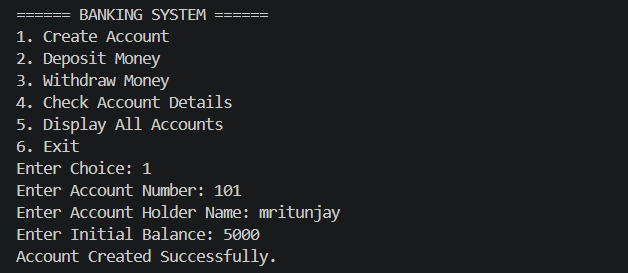
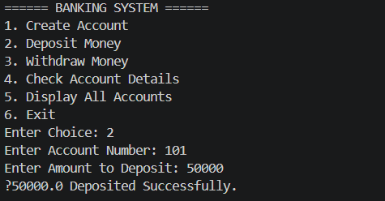
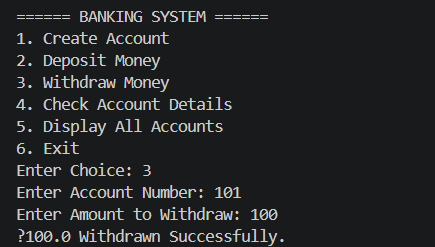

# Banking System in Java

A simple console-based Banking System project developed using Java.

## Features
- Create Account
- Deposit Money
- Withdraw Money
- Check Account Details
- Display All Accounts

## Technologies Used
- Java
- OOP Concepts
- ArrayList
- Scanner Class

## Run Project

```bash
javac BankingSystem.java
java BankingSystem
```

## Screenshots

### Banking System Output

#### Main Menu


#### Create Account


#### Deposit Money


#### Withdraw Money


## Project Structure

```text
Banking-System-Java
│
├── BankingSystem.java
├── README.md
└── screenshot
    ├── menu.png
    ├── user.png
    ├── deposit.png
    └── withdraw.png
```

## Author

Mritunjay Bhardwaj